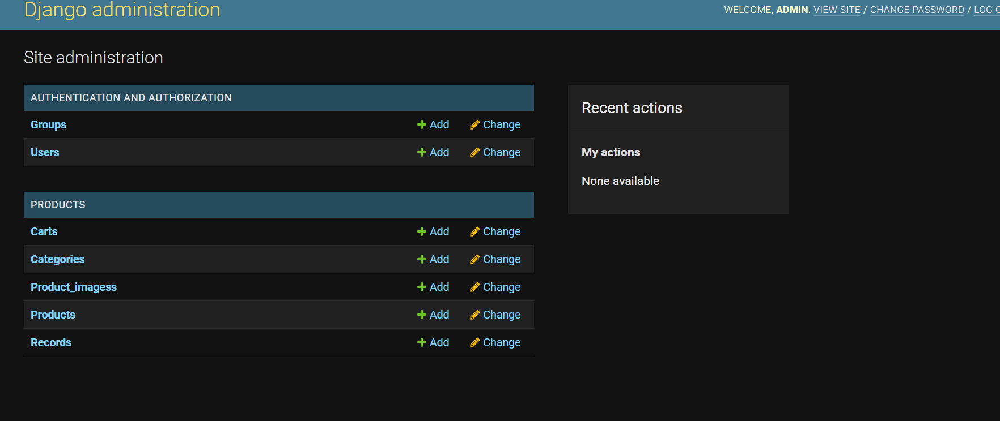
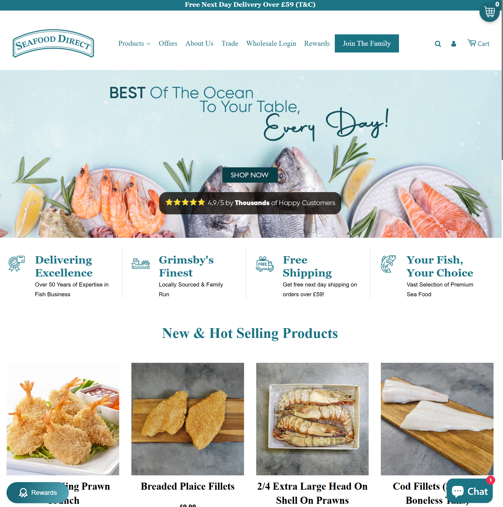
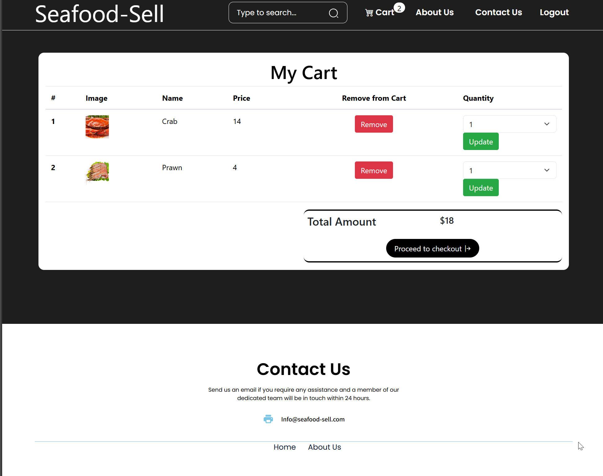

# Seafood Sell
 ---
 

     

[View My Github Project - Regular Link](https://seafoodsell.pythonanywhere.com/)
[View My Github Project - Admin link](https://seafoodsell.pythonanywhere.com/admin/)

 ## Introduction
 
'Seafood Sell' (Ssell) is an online company that offers the user a range of seafood to purchase. It is the demo/ proof of concept for a real business, similar to my previous project "Filmlab Productions." The site provides customers live prices and the ability to add various seafood items into a 'cart.' Once the customer wishes to proceed, they can edit and/ or finalise the order by entering their payment details.

Once a customer proceeds to the checkout, they will will be provided the option to edit their cart, offering full flexibility on the clients end. Once the customer is satisfied, they will have the opportunity to make a payment and checkout using 'Stripe.' They will also recieve feedback on wether or not the purchase was succesfully completed.

Ssell offers a fully adaptive display, from a range of devices, allowing more users online to purchase goods and services from the business. The app has a working navigation menus and a login/ sign-up button on the right, located by the nav bar.

---

Example Login Details (IE. Being able to add or edit items and their category/ price) Heroku. This account would be different once the official app is published, as this is just a demo of what you can see as the owner of the business:

    User: admin
    Email: admin@gmail.com
    Password: admin

Here is an example of the display of the admin pannel:

Alternatively, you can also sign up an account for the demo by using the sign-up page: in the top right of the page

Once the user has registered an account, they will have the option to login. Note, a login will be required to purchase an item.

To protect your card details, I am running this demo with the Stripe demo account. So please enter these details when making payments upon landing on the card payment page:

    - to ensure the user does not need to input their sensitive details into the demo, the user can use the card number:
    - 4242 4242 4242 4242 (IMPORTANT, CARD NUMBER for Stripe test mode - otherwise the card number will not work)

 ---

### Deployment of Project

    1 - To run this project remotely, you would require the 'dotenv' module. You can install this module in the terminal with the following code:
        - pip install python-dotenv

    2 - Create a Virtual Environment, to isolate your project dependencies, using the following command:
        - python -m venv env
    
    3 - Activate the virtual environment:
        Windows
        - .\env\Scripts\activate
        MacOs/Linux
        - source env/bin/activate

    4 - Install all requirements and modules using the following:
        - pip install -r requirements.txt

    5 - Database Migrations:
        * Django uses migrations to manage database schema changes.
        * First, create initial migrations for your app(s):
        - python manage.py makemigrations
        * Apply the migrations to create database tables:
            - python manage.py migrate

    6 - Create a Superuser (Admin):
        - python manage.py createsuperuser

    7 - Run on local server:
        - python manage.py runserver
    
    8 - Time to open your server:
        * Visit http://127.0.0.1:8000/ in your browser to see your Django app.

 ---
 ## CONTENTS:
 ---

* [User Experience - UX](#user-experience) 
    * [First Time Visitor GOAL](#first-time-visitor-goal)
    * [Return Visitor GOAL](#returning-visitor-goal)

* [Design](#design)
    * [Features](#features)

* [Features](#features)
    * [Future Implementations](#future-implementations)

* [TESTING](#testing)

* [Acknowledgments](#acknowledgments)

---
## User Experience:

### First Time Visitor GOAL

    1 - To quickly find out what products Ssell is offering

    2 - To find out if Ssell is a legitimate business, does this webapp legitimise the company?

    3 - To find out information on the team behind Ssell, follow the latest news about the company, where the company is based, and to contact the company directly

    4 - What the company is about and where they source their items

### Returning Visitor GOAL
    1 - One user might be an admin or owner of the website. This user would require a way to list and describe new items, along with the ability to edit existing ones.
    2 - Look for discounts or sales at that time
    3 - Be able to contact the business regarding business enquiries

---
## Design:
The design of this project was simple. I wanted to keep this project focused on functio over form, and I would say that I have achieved that while managing to submit this as fast as I possibly could. However, I did take inspiration from the website 'Seafood Direct' 

---
## Features:
---
The features are currently split between the edit functions of the Admin & the control over the cart for the regular user interface.

Below I have listed all of the features/functions available in this project:
    - User authentication and authorization
    - Product browsing by categories
    - Cart functionality
    - Stripe payment integration
    - Order history and management
    - vDatabase Schema
    - Models
    - Categorie

    - id (Primary Key)
    - categorie (CharField)
    - Products

    - id (Primary Key)
    - name (CharField)
    - description (TextField)
    - price (DecimalField)
    - Categorie (ForeignKey to Categorie)
    - Cart

    - id (Primary Key)
    vproduct (ForeignKey to Product)
    - loged_user (ForeignKey to User)
    - Record

    - id (Primary Key)
    - customer_email (EmailField)
    - amount_total (DecimalField)
    - payment_intent (CharField)
    - payment_id (CharField)
    - status (CharField)
    - CRUD Functionalities
    - Categories
    - Create: Admin can create a new category.
    - Read: Users can view all categories.
    - Update: Admin can update a category.
    - Delete: Admin can delete a category.
    - Products
    - Create: Admin can add new products.
    - Read: Users can view products by category.
    - Update: Admin can update product details.
    - Delete: Admin can delete a product.
    - Cart
    - Create: Users can add products to their cart.
    - Read: Users can view their cart.
    - Update: Not applicable.
    - Delete: Users can remove products from their cart.
    - Records
    - Create: Records are created upon successful payment.
    - Read: Admin can view payment records.
    - Update: Not applicable.
    - Delete: Admin can delete records if necessary.

### Future Implementations
    In the furture I will expand on the complexity of the website, by adding moreproducts, including a way to purchase products without a login. I would also like to include a live chat feature, or a chatbot to make communicating with potential business partners easier.

    One additional feature would include, having the site also aid in guiding users to the physical store, and offers insights into the operations of the business. This can be simply implemented using google maps and Iframes.

---
## Testing:
[Testing found here](TESTING.md) 

---
##  Acknowledgments:
I used the design at 'https://seafooddirect.co.uk' as a reference for what I want my website to look like. I also used Chat GPT to correct spelling and make item descriptions.