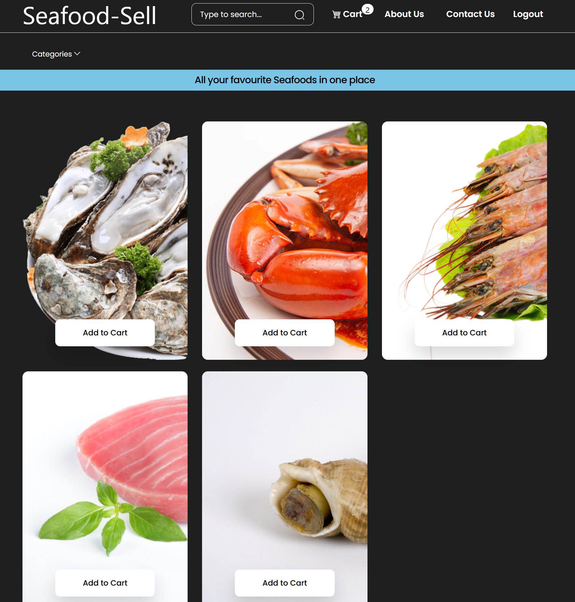
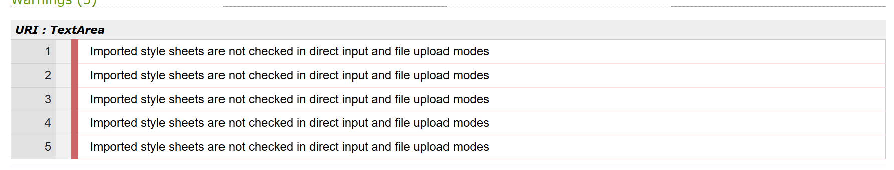
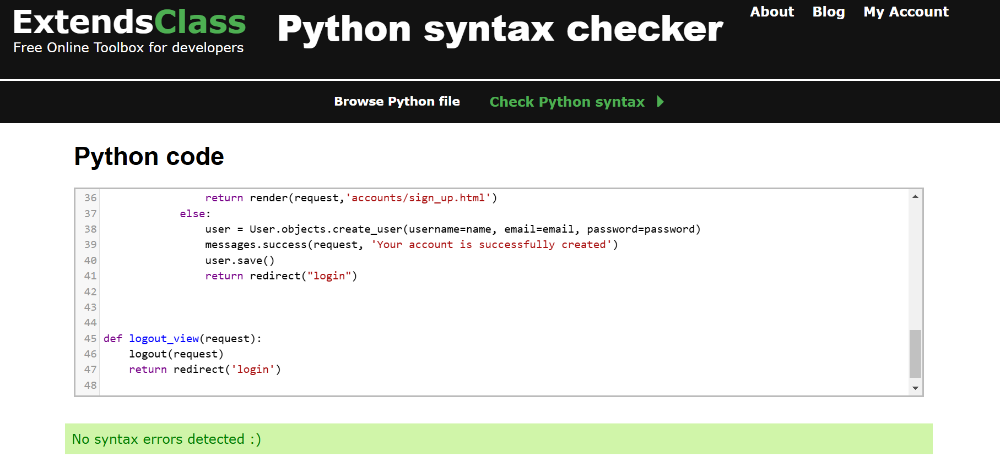

# Testing - Filmlab Productions

---
## Contents:
  * [W3C Validator](#w3c-html-validaton)
  * [Jigsaw](#jigsaw-css-validation)
  * [Testing User Stories](#testing-user-stories)
---

## Jigsaw CSS Validation

The css passed every validator flawlessly, only having issues with understanding the code pretaining to Bootstrap.

## W3C HTML Validation

I have fixed most errors not related to Django. However, I would require more understanding of the procedures relating to the validation of such code. This is certainly my own limitation and I will work on this skill going forward.

## PEP8 - manage.py

  In my code there were no major errors. Only referingto white spaces and and lines being too long. In this regard the code fails these tests. However the end user will not experience any errors due to them.

  ExtendClass Python Syntax Checker:

## Testing User Stories:

### First Time Visitor
| User Story |Pass or Fail |Soloution & Result |
| :---- |:-- |:-------|
|1 - To quickly find out what products Ssell is offering|Pass|Finding Ssell's newest products are easy, it is the first thing that a site visitor will see when they enter the page. When loading the homepage (which is also reached by clicking 'Seafood-Sell'), the user will be greeted with a array of products with the corrisponding image for said product.|
|2 - To find out if Ssell is a legitimate business, does this webapp legitimise the company?|Pass|On Ssell finding out if it is a legitimate supplier is simple. A user can navigate through the products listed in the home page, or contact the company via the email listed below. The only thing that I could do in the future to improve this would be to allow reviews on the website itself, providing greater authenticity.|
|3 - To find out information on the team behind Ssell, follow the latest news about the company, where the company is based, and to contact the company directly.|Pass|On this site, the user is able to stay up to date with the about us page. However, this is still lacking some features and needs to be improved to provide more information.|
|4 - What the company is about and where they source their items.|Pass|Activists and nutritunalists usually like to know where their food came from and if they meet rigorous tests and procedures before arriving to the customer. This is easily accessible underneath the description of the product, where it describes everything about the product in detail. However, the information listed is limited due to my own time constraints with writing descriptions on each item.|

### Returning Visitor GOAL
| User Story |Pass or Fail |Soloution & Result |
| :---- |:-- |:-------|
|1 - One user might be an admin or owner of the website. This user would require a way to list and describe new items, along with the ability to edit existing ones.|Pass|The Admin user can create new items, add or remove an image and change the description/ catagory of the item.|
|2 - Look for discounts or sales at that time|Fail|While prices are listed on the site, the items do not show a before and after, making it challanging for users to compare yesterdays price to the price of today. For this reason, it does not pass this test for me.|
|3 - Be able to contact the business regarding business enquiries|Pass|Investors will have an inherent interest in contacting the company directly. To navigate to this section, there is one method. To go to the navigation bar, on 'contact us' and it opens the email app. However, this may not be the best experience as it takes the user off the page. This is easily accomplished through the "Contact us" hyperlink. However, as this takes the user to another app, this can be seen as less desirable for the user.|
